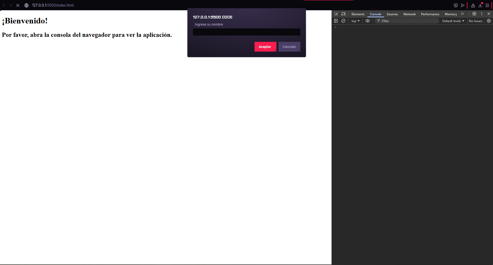
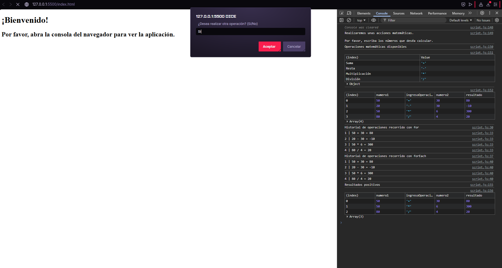
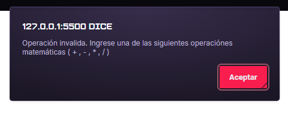

# Aplicación de calculadora en JavaScript

## Descripción
Este proyecto consiste en una aplicación que funciona por medio de la consola del navegador, fue desarrollada utilizando JavaScript. Permite ejecutar operaciones matemáticas básicas mediante  el uso de "prompt" y "alert".

La aplicación empieza solicitando el nombre del usuario, brindando en la consola la información sobre las funciones que logra realizar. Seguido de eso procede a solicitar los numeros y la operación matemática deseada, mostrando el resultado en un historial en la consola del navegador.

## Funcionalidades

-Ingreso de datos por medio de "prompt"
-Operaciones matemáticas básicas:
    -Suma
    -Resta
    -Multiplicación
    -División
-Validación al ingresar datos
-Previene división por 0
-Registro en historial
-Filtro de resultados
-Actualización de consola utilizando `console.clear()`

## Links

Repositorio GitHub: https://github.com/RitaVarv/Aplicaci-n-de-consola---Proyecto-M-dulo-4.git

GitHub Pages: https://ritavarv.github.io/Aplicaci-n-de-consola---Proyecto-M-dulo-4/

## Screenshots

